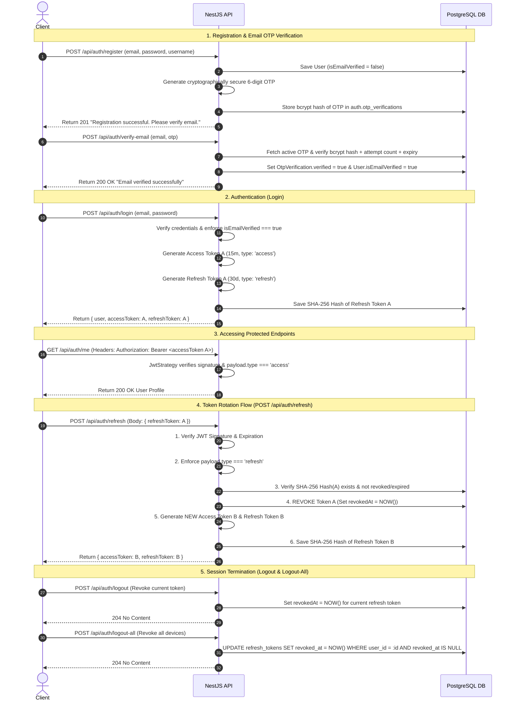

# 📚 Kuroyomi Secure Ebook API

A secure, robust backend API for a manga & ebook reading platform built with **NestJS**, **TypeORM**, and **PostgreSQL**.

---

## 🚀 Getting Started

Quick commands to get the application up and running.

### 1. Installation
```bash
pnpm install
```

### 2. Running the App

The project supports environment-specific configurations loaded via `cross-env`:

| Environment | Start Command | Loaded Configuration |
| :--- | :--- | :--- |
| **Development** | `pnpm start:dev` | `.env.development` |
| **Staging** | `pnpm start:staging` | `.env.staging` |
| **Production** | `pnpm start:prod` | `.env.production` |

---

## 🗄️ Database Management (Migrations & Seeds)

We use a standalone TypeORM DataSource configuration ([data-source.ts](file:///c:/2026%20Projects/kuroyomi-api/ebook-api/src/database/data-source.ts)) to handle migrations and custom seeds.

### 📊 Migrations

To keep the database schema in sync with TypeORM entities:

*   **Generate a Migration:**
    ```bash
    pnpm migration:generate src/database/migrations/<MigrationName>
    ```
*   **Run Pending Migrations:**
    ```bash
    pnpm migration:run
    ```
*   **Revert Last Migration:**
    ```bash
    pnpm migration:revert
    ```

> [!WARNING]
> If you are using a custom PostgreSQL schema (such as `"auth"`), TypeORM will **not** automatically create it. Always add `await queryRunner.query('CREATE SCHEMA IF NOT EXISTS "auth"');` at the beginning of the generated `up` method.

### 🌱 Seeding (Idempotent)

Seeds populate the database with default data without creating duplicates.

*   **Seed All Database Data:**
    ```bash
    pnpm seed
    ```
*   **Seed Roles Only (ADMIN/USER):**
    ```bash
    pnpm seed:roles
    ```

---

## 🛠️ Feature Checklist & Roadmap

Progress tracker for building the platform features.

### 🏗️ Infrastructure & Core Setup
- [x] NestJS Application Initialization
- [x] PostgreSQL Integration with TypeORM
- [x] Environment Configuration (`.env.*` loader)
- [x] Schema Validation via `Joi`
- [x] Database Module & Logging Setup
- [x] Authentication Entities (`User`, `Role`, `UserRole`, `RefreshToken`, `OtpVerification`)
- [x] Database Migrations setup
- [x] Seeding Infrastructure with Idempotent Role Seeder

### 🔐 Authentication System

#### Database & Infrastructure
- [x] Auth Entities (`User`, `Role`, `UserRole`, `RefreshToken`, `OtpVerification`)
- [x] Migrations & Schema Setup
- [x] Idempotent Seeders (`seed:roles`, `seed`)
- [x] Config Module & Setup
- [x] `PasswordService` (bcrypt hashing)
- [x] `TokenService` (Access & Refresh tokens lifecycle)
- [x] `UsersService` (User operations & role assignments)
- [x] `RefreshTokenService` (Hashed token persistence & session revocation)
- [x] `OtpService` (Cryptographically secure OTP generation, bcrypt hashing & attempt limiting)
- [x] `MailService` (Nodemailer email delivery for OTP verification & password resets)

#### Features & API Progress
- [x] User Registration (`POST /api/auth/register`)
- [x] Email OTP Verification (`POST /api/auth/verify-email`)
- [x] User Login (`POST /api/auth/login`)
- [x] JWT Strategy (`passport-jwt`)
- [x] JWT Auth Guard (`JwtAuthGuard`)
- [x] Authenticated User Profile (`GET /api/auth/me`)
- [x] Refresh Token API (`POST /api/auth/refresh`)
- [x] Refresh Token Rotation (`POST /api/auth/refresh`)
- [x] Single Device Logout (`POST /api/auth/logout`)
- [x] Logout All Devices (`POST /api/auth/logout-all`)
- [x] Global JWT Auth Guard (`APP_GUARD`) & `@Public()` Bypass Decorator
- [x] `@CurrentUser()` Parameter Decorator & `JwtUser` Interface
- [x] Forgot Password (`POST /api/auth/forgot-password`)
- [x] Reset Password (`POST /api/auth/reset-password`)
- [x] Roles Guard & Authorization (`@Roles()`, `RolesGuard`)

---

### 🔑 Dual-Token Architecture & Security Deep-Dive

> [!NOTE]  
> All endpoints are prefixed with `/api` (configured in `main.ts` via `app.setGlobalPrefix('api')`).

#### 💡 Why Dual Tokens with Rotation? (Access vs. Refresh Tokens)

In web applications, using a single token causes trade-offs between security and usability:
- **Single Short-Lived Token**: Forces users to re-enter credentials constantly, degrading UX.
- **Single Long-Lived Token**: Creates a massive security risk if intercepted, as an attacker retains access indefinitely without any server-side mechanism to revoke it.

Our system solves this using a **Dual-Token Architecture with Automatic Refresh Token Rotation**:

1. **Email Verification Gate (Prerequisite)**
   - Registration creates a user with `isEmailVerified = false` and generates a hashed 6-digit OTP (valid for 10 minutes, max 5 attempts).
   - Unverified users cannot log in or generate JWT sessions until `POST /api/auth/verify-email` is completed successfully.

2. **Access Token (Short-lived — 15 minutes)**
   - **Why**: Used for authenticating every API request. Short lifespan minimizes the vulnerability window if a token is intercepted.
   - **How**: Fully **stateless**. Verified in-memory by cryptographic signature (`JWT_SECRET`) in `JwtStrategy` without hitting PostgreSQL, preserving database performance.
   - **When**: Sent by the client in the `Authorization: Bearer <token>` header on every protected request (e.g., `GET /api/auth/me`, purchasing, reading).

3. **Refresh Token (Long-lived — 30 days) with Rotation & Session Management**
   - **Why**: Allows users to stay authenticated seamlessly without re-entering credentials.
   - **Rotation Security**: Every time `POST /api/auth/refresh` is called, the used Refresh Token is **immediately consumed and revoked** (`revokedAt = NOW()`), and a brand-new Refresh Token + Access Token pair is issued. If an old consumed refresh token is ever reused, the request is instantly rejected.
   - **Multi-Device Logout Support**: Supports revoking single device sessions (`POST /api/auth/logout`) or revoking **all** active device sessions simultaneously (`POST /api/auth/logout-all`).
   - **How**: **Stateful & Hashed**. Signed with a distinct secret (`JWT_REFRESH_SECRET`) and stored as a **SHA-256 hash** in PostgreSQL (`auth.refresh_tokens`).
   - **When**: Sent in the request body to `POST /api/auth/refresh` exclusively when the Access Token has expired.

---

#### 🔄 Token & Authentication Lifecycle Sequence Flow



---

#### 🔁 Detailed Breakdown: Refresh Token Rotation & Security Benefits

##### 1. The Security Problem Without Rotation (Static Refresh Tokens)
In a static refresh token design, a single `Refresh Token A` remains valid for its entire 30-day lifespan. If an attacker intercepts or steals `Refresh Token A`:
- The attacker can call `POST /api/auth/refresh` repeatedly for 30 days to obtain fresh access tokens.
- The server has no automatic way of knowing that `Refresh Token A` was compromised.

##### 2. The Solution: Single-Use Token Rotation
With **Refresh Token Rotation**, every refresh token is **strictly single-use**. Consuming a refresh token automatically burns it and replaces it with a new pair:

- **Step 1 (Request)**: Client sends `Refresh Token A` to `POST /api/auth/refresh`.
- **Step 2 (Verification)**: Server verifies JWT signature and looks up `Hash(Refresh Token A)` in PostgreSQL.
- **Step 3 (Consumption & Revocation)**: Server marks `Refresh Token A` as revoked by setting `revokedAt = NOW()`.
- **Step 4 (Issuance)**: Server generates a new `Access Token B` AND a new `Refresh Token B`.
- **Step 5 (Persistence)**: Server saves `Hash(Refresh Token B)` into PostgreSQL and returns both tokens to the client.

##### 3. How Token Reuse Neutralizes Theft
If an attacker attempts to use `Refresh Token A` after it has already been rotated:
1. The server computes `SHA256(Refresh Token A)` and queries `auth.refresh_tokens`.
2. The server detects that `revokedAt` is **NOT NULL** (token was already consumed).
3. The server immediately aborts execution and returns `401 Unauthorized`.
4. The stolen token is completely useless.

---

#### 🛡️ Security Controls & Enforcement Rules

| Security Layer | Implementation & Purpose |
| :--- | :--- |
| **Email Verification Gate** | `isEmailVerified` must be `true` before `POST /api/auth/login` will issue tokens. Prevents unverified account access. |
| **Hashed OTP & Attempt Limit** | OTP codes are 6-digit cryptographically secure numbers, bcrypt hashed, valid for 10 minutes, and capped at 5 attempts to prevent brute-forcing. |
| **Strict Token Type Scoping** | Every payload includes `type: 'access'` or `type: 'refresh'`. This prevents cross-use of tokens. |
| **Automatic Token Rotation** | Every refresh request revokes the old refresh token (`revokedAt = NOW()`) and issues a fresh pair. |
| **Protected API Defense** | `JwtStrategy` rejects any token where `type !== 'access'`. |
| **Refresh Endpoint Defense** | `AuthService.refresh()` enforces `type === 'refresh'`. |
| **Database Token Hashing** | Raw Refresh Tokens are stored as SHA-256 hashes in `auth.refresh_tokens`. |
| **Session Revocation (Logout / Logout All)** | Supports single-token revocation (`/auth/logout`) and revoking all active user sessions (`/auth/logout-all`). |

---

## 📦 Built-in Tech Stack & Packages

The project has the following modules configured and ready to use:

*   **Core:** `@nestjs/common`, `@nestjs/core`, `@nestjs/platform-express`
*   **Configuration & Validation:** `@nestjs/config`, `joi`, `class-validator`, `class-transformer`
*   **Database & ORM:** `@nestjs/typeorm`, `typeorm`, `pg` (PostgreSQL)
*   **Auth & Security:** `@nestjs/jwt`, `@nestjs/passport`, `@nestjs/throttler`, `passport`, `passport-jwt`, `passport-local`, `bcrypt`, `helmet`, `cookie-parser`
*   **Emailing:** `nodemailer`
*   **API Documentation:** `@nestjs/swagger`, `swagger-ui-express`